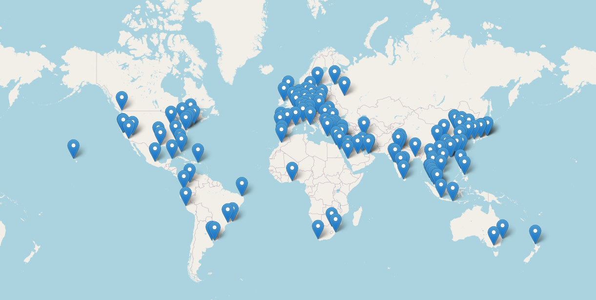
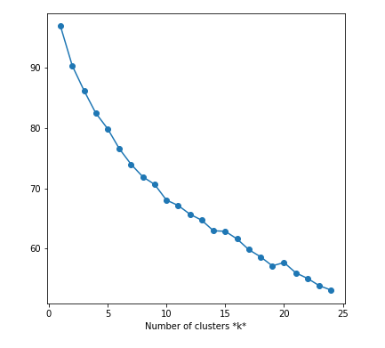
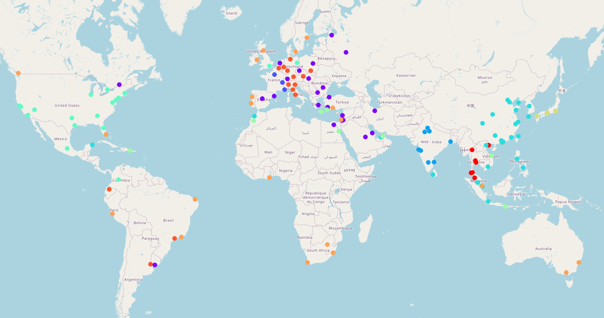

# Clustering destinations
### Áron Dudás
### May 11, 2020

## 1. Introduction

### 1.1 Background
International tourism is a multi billion dollar industry. Every year tens of millions of tourists visit cities internationally. Thanks to the wide range of availiable cheap air travel (well, at least before COVID-19) tourists have a plethora of cities to chose from. But every city is different and the available activities differ from region to region, culture to culture, city to city.

### 1.2 Problem
Since tourist have so many options to choose from, it can be difficult to chose their next destination. By clustering cities by available leisure activities, we can narrow down the list of possible destinations to ones that are similar to cities previously visited and liked, and spare them from looking up  information on cities they most like will not like.

#### 1.3 Interest
The main target is obviously the tourist. But besides tourists travel agencies could also make use of such solutions for example to power recommender systems or targeted advertising. An other possible beneficiary of such informations are tourism agencies. By having this information they can compare their regions with that of their competitors and plan their strategies accordingly.

## 2. The Data

### 2.1 Data sources
For the list of the most visited cities I will use [this Wikipedia page](https://en.wikipedia.org/wiki/List_of_cities_by_international_visitors). This page aggregates data from the financial services corporation Mastercard, and the consulting firm Euromonitor. Altough this data is not the most recent (Euromonitor data is for 2018, and Mastercard data is for 2016) it will be a good starting point. Also this is the most detailed data source I found freely available on this topic.

The cities scraped from Wikipedia are show in the following map:  
  

To cluster the cities listed in the page mentioned above, I will use Foursquare's venue data. Foursquare provides location data on many different type of venues like museums, music venues, restaurants and so on. By using Foursquare's explore API I can get a list of popular venues for each city.

### 2.2 Data preparation
The data for the cities gathered from Foursquare needs to be preprocessed. To be able to determine clusters I need to quantify the venue data.

First I examined the data regarding the number of venues per city. I found that apart from two cities (Mecca and Medina) I have suffucuent amount of venues to cluster the cities.

Then I examined the data regarding the frequency of the categories. I found that there are lots of categories that are too unique or too common to be useful.

I removed the venues that belonged to either the discarded cities or categories. After dropping 6447 venues from the total of 26924 I stil had 20477 data points to work with.

The veue data in this form still cannot be used for clustering, so I created dummy features for each category and then aggregated the venues grouped by city. The category data is almost ready for clustering. The only remaining step is to normalize these values using sklearn's preprocessing library.

## 3. Methodology

I decided to use the K-Means algorithm for the custering. After cleaing the data as described in the previous paragraph the only thing left is to determine the K value. For this I used the elbow method. I tested K-Means for different Ks (1-25) to see which value gives the best results.  
The result is shown in the following plot:  
  
Unfortunately there is no clear elbow visible on the plot. After trying different data cleaning and feature normalization methods without no significant results I decided to use the best K from this graph, which is at K=10 where the curve's slope changes.

## 4. Results

After clustering the cities using the venues data into 10 clusters I got the following results:  

The fact that the clusters based purely on venue data shows that the cities in the clusters in most cases are also geographically located near each other indicates that the clustering is working as expected.

The list of cities in each cluster:
 - Cities in **Cluster 0**:
    - Amman, Amsterdam, Athens, Barcelona, Beirut, Bucharest, Budapest, Cairo, Dammam, Istanbul, Jerusalem, Madrid, Montevideo, Montreal, Moscow, Muğla, Prague, Riyadh, Saint Petersburg, Sofia, Tehran, Warsaw, Zürich
 - Cities in **Cluster 1**:
    - Geneva, Nice, Paris
 - Cities in **Cluster 2**:
    - Agra, Bangalore, Chennai, Delhi, Jaipur, Kolkata, Mumbai, Pune
 - Cities in **Cluster 3**:
    - Abu Dhabi, Batam, Beijing, Cancún, Casablanca, Cebu City, Chengdu, Colombo, Dalian, Guangzhou, Guilin, Hangzhou, Hanoi, Ho Chi Minh City, Jakarta, Jeju, Johor Bahru, Kuala Lumpur, Manila, Qingdao, Seoul, Shanghai, Shenzhen, Taipei, Tianjin, "Xian", Xiamen, Zhuhai
 - Cities in **Cluster 4**:
    - Atlanta, Berlin, Bogota, Boston, Chicago, Dallas, Houston, Las Vegas, London, Los Angeles, Mexico City, New York City, Orlando, Philadelphia, San Francisco, San Jose, Toronto, Washington D.C.
 - Cities in **Cluster 5**:
    - Da Nang, Denpasar, Dubai, Heraklion, Hurghada, Marrakesh, Punta Cana, Rhodes
 - Cities in **Cluster 6**:
    - Chiba, Fukuoka, Kyoto, Osaka, Tokyo
 - Cities in **Cluster 7**:
    - Accra, Antalya, Auckland, Cape Town, Copenhagen, Dublin, Durban, Edinburgh, Hong Kong, Honolulu, Johannesburg, Lima, Lisbon, Macau, Melbourne, Miami, Porto, Rio de Janeiro, Singapore, Stockholm, Sydney, Tel Aviv, Vancouver
 - Cities in **Cluster 8**:
    - Brussels, Buenos Aires, Düsseldorf, Florence, Frankfurt am Main, Hamburg, Kraków, Milan, Munich, Quito, Rome, São Paulo, Venice, Vienna
 - Cities in **Cluster 9**:
     - Bangkok, Chiang Mai, Ha Long, Krabi, Pattaya, Penang Island, Phuket

Further examining the clusters I got the following results:
 - Top categories for **Cluster 0**:
    - Dessert Shops (23)
    - Gyms (23)
    - Middle Eastern Restaurants (23)
    - Fast Food Restaurants (23)
    - Ice Cream Shops (23)
    - Plazas (23)
    - Italian Restaurants (23)
    - Falafel Restaurants (23)
    - Shopping Malls (23)
    - Supermarkets (23)
 - Top categories for **Cluster 1**:
    - French Restaurants (3)
    - Bars (3)
    - Supermarkets (3)
    - Restaurants (3)
    - Italian Restaurants (3)
    - Pizza Places (3)
    - Plazas (3)
    - Swiss Restaurants (3)
    - Grocery Stores (3)
    - Burger Joints (3)
 - Top categories for **Cluster 2**:
    - Indian Restaurants (8)
    - Historic Sites (8)
    - Resorts (8)
    - Fast Food Restaurants (8)
    - Multicuisine Indian Restaurants (8)
    - Markets (8)
    - Pizza Places (8)
    - Restaurants (8)
    - Arts & Crafts Stores (8)
    - Train Stations (8)
 - Top categories for **Cluster 3**:
    - Middle Eastern Restaurants (28)
    - Resorts (28)
    - Beaches (28)
    - Shopping Malls (28)
    - Restaurants (28)
    - Supermarkets (28)
    - Steakhouses (28)
    - Hotel Bars (28)
    - Japanese Restaurants (28)
    - Pizza Places (28)
 - Top categories for **Cluster 4**:
    - Trails (18)
    - Breweries (18)
    - Pizza Places (18)
    - Discount Stores (18)
    - Ice Cream Shops (18)
    - Mexican Restaurants (18)
    - Southern / Soul Food Restaurants (18)
    - Breakfast Spots (18)
    - Sandwich Places (18)
    - Fast Food Restaurants (18)
 - Top categories for **Cluster 5**:
    - Vietnamese Restaurants (8)
    - Resorts (8)
    - Beaches (8)
    - Spas (8)
    - Restaurants (8)
    - BBQ Joints (8)
    - Hotel Bars (8)
    - Mountains (8)
    - Caves (8)
    - Burger Joints (8)
 - Top categories for **Cluster 6**:
    - Ramen Restaurants (5)
    - Sushi Restaurants (5)
    - Italian Restaurants (5)
    - Convenience Stores (5)
    - Drugstores (5)
    - Supermarkets (5)
    - Clothing Stores (5)
    - Steakhouses (5)
    - Indian Restaurants (5)
    - Chinese Restaurants (5)
 - Top categories for **Cluster 7**:
    - African Restaurants (23)
    - Restaurants (23)
    - Pubs (23)
    - Lounges (23)
    - Indian Restaurants (23)
    - Fast Food Restaurants (23)
    - Bars (23)
    - Nightclubs (23)
    - Shopping Malls (23)
    - Cocktail Bars (23)
 - Top categories for **Cluster 8**:
    - Italian Restaurants (14)
    - Plazas (14)
    - French Restaurants (14)
    - Bars (14)
    - Supermarkets (14)
    - Friteries (14)
    - Farmers Markets (14)
    - Restaurants (14)
    - Gyms or Fitness Centers (14)
    - Fast Food Restaurants (14)
 - Top categories for **Cluster 9**:
    - Noodle Houses (7)
    - Thai Restaurants (7)
    - Shopping Malls (7)
    - Bars (7)
    - Asian Restaurants (7)
    - Dessert Shops (7)
    - Supermarkets (7)
    - Spas (7)
    - Seafood Restaurants (7)
    - Japanese Restaurants (7)

## 5. Conclusion

### 5.1 Discussing the results

This study is a basic analyzis on the different types of the cities visited by the most tourists. The algorithm clearly finds existing patterns, however to determine it's accuracy further analyzis and somain knowledge is necessary.

The fact that during the modelling we could not find any definite elbow in the plot show us that, using only venue data provided by Foursquare does not provide sufficient information for this kind of clustering or a different clustering algorithm is to be used.

### 5.2 Further improvements

The model and/or data used in this study needs improvements.

To provide more information for the clustering algorithm we could gather more data for the cities for example the yearly average temprature or some economical data like the average price of a guest night in USD or the domestic food price index.

If adding more diverse data does not improve enaugh on the clustering, then other algorithms like DBSCAN or spectral clustering shuold be considered.